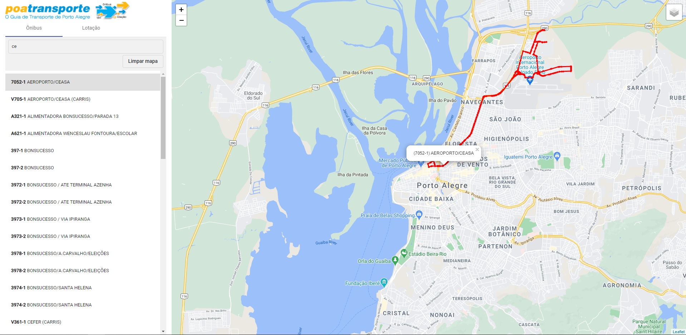

# DataPoaLine

  

## Escopo

Este projeto é uma aplicação integrada com a API do DataPoa: http://datapoa.com.br/group/about/mobilidade.

Esta aplicação apresenta uma tela intuitiva que possibilita ao usuário pesquisar sobre linhas de ônibus ou lotação.
É possível ao usuário fazer a busca através de filtro por nome ou código da linha, além de poder consultar o itinerário da unidade de
transporte diretamente no mapa da aplicação.

## Tecnologias

- Angular CLI 10.0.1
- Angular Material: 10.2.7
- Bootstrap 4.6.0
- Leaflet: 1.6.0

## Como instalar

- Baixe ou clone este repositório usando `git clone https://github.com/geisonfeitosa/DataPoaLine.git`.
- Dentro do diretório, execute `npm install` para instalar as dependências.

## Como executar

- Dentro do diretório, execute `ng serve` para executar a versão de desenvolvimento.
- Depois acesse `http://localhost:4200/`.

# DataPoaLine
